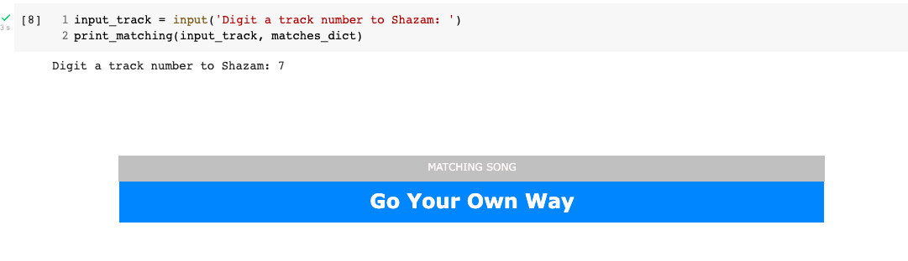

# Homework 4 - Group12
Algorithmic Methods of Data Mining course at the Data Science Master's Degree in Sapienza

#### Benedetta Candelori, Cosmin Zaharia & Matteo di Mauro
This repository contains 3 files: 
> `main.ipynb` 
> This is a python notebook which contains our solutions to the exercises of the homework.
> 
> **IMPORTANT** 
> The output of the exercise 1 (*Implement your own Shazam*) is not complete. You can see it opening the notebook on Colab. It should be:
> 
> 

> `functions.py`
> In order to make the code in the *main* notebook more readable, we have imported all useful functions at the top of the notebook from this file *.py*.

> `matching_dict.json`
> It is a .json file which contains a dictionary that maps each query track to the correct matching song! We have obtained it from the implementation of our Shazam.
